# 登录排队服务器QueueServer

## 需求说明

#### 最近得到了一个某趣Plus公司面试的机会，面试过程应该属于他们认可能接收的程度，工作经验也对口
#### 面试完之后，他们说公司是有个惯例，出一个编程题，然后要求自己回去完成把代码发给他们

题目如下：
```
在面试后请候选人用GoLang完成编程作业： 

* 问题描述:
  新游戏在开服后往往会有瞬时大量用户登录涌入的高峰流量，对服务器产生压力。
 
* 解决方案:
  开发开服排队系统，对到达服务器的大量用户进行队列缓冲，名为QueueService，根据服务器压力情况，逐步让队列中的用户拿到登录服务器的令牌（token），代表该用户请求可以被处理了，从而缓解登录高峰，排队中用户要能够“实时”知道自己在队伍中的位置变更。
 
* 开发要求:
   线下，无时间限制
* 交付:
  * 服务器QueueService：要求使用GoLang编写, 使用channel, 使用tcp长连接通信. 要求按照工业级代码标准开发, 比如高并发下吞吐瓶颈是否合理, 各种边界处理是否完备, 在系统发生错误时进程是否健壮
  * 客户端：对QueueService发起请求， 并对队列进行实时监控。要求使用GoLang编写, 使用tcp长连接通信
  * 文档：说明怎样部署和运行, 如何进行压测, 最好有完整压测数据(QPS, RTT, CPU, Mem等)
```

我花费了三天的时间，完成了这个项目，这中间还一度失眠没睡好  
发给他们后一直没反馈，我主动问了才给了反馈  
  

看到这个结果对我还是有点受打击和气愤的  
  * golang不熟悉：之前工作中主要是用C++，但对golang深入学习过(源代码层)，用golang只写过小项目，面试的时候我透露了这一点，目前这个小项目上能体现出好不好，我也不好判断
  * 代码库选的不对：这个.. 我无法接受，选用的gnet开源库是经过测试验证的，接口易使用易理解，且内置了ants协程池，官方甚至还附带了使用gnet作为底层网络服务的公司(腾讯、小米、百度、360)
  * 整体行文没有做到分层和结构化：这个就抽象了，怎么说都有理，项目中功能基本都封装成模块了(msg,sequence,queue,conn,client)，相互耦合度的并不高，不知道这样一个小的项目还能做出什么高度的分层和结构化
  * 那个tcp连接要求自己管理：在题目要求中，我是真心的没找到这么一条


#### 辛苦了两天多，就用这几句没有所以然的话打发了，挺操蛋的，这也是我气愤的地方  
#### 当然工作都是双向选择的，人家不选择你也没有必要灰心，小小的总结下：人在江湖飘,岂能不挨刀,万事顺其道,所以不要太计较
#### 这里就把项目原封不动的上传下，以便以后自己重新评估下  
#### 最近一段时间面试了几个工作，后来总结下，有几个就是被别人当枪使，有些公司的人事部门让你去面试，纯粹的就是完成他们自己的业绩，对此表示很无奈  
#### 下面是我当时写的一个文档说明，当时也是一边就过了，可能有错别字  
#### 代码中没有加入过多的概念，尽量保持足够的简洁高效，但使用了一些已封装的goroute池子的概念，并以此封装了一个sequence来顺序执行，保证数据多协程安全访问  

##技术选型
* gnet
  * 基于 Event-Loop 事件驱动的高性能和轻量级网络库，解决大量socket高并发问题  `per socket per goroutine`
  * 融合了ants协程池，解决大量协程问题 `per msg per goroutine`
* zerolog
  * 高性能,支持日志等级,钩子的结构化日志库
  * 输出格式多样化，支持json格式，便于读取分析
* protobuf
  * 协议数据交换格式工具，易于使用且销量高


## 工程文件结构
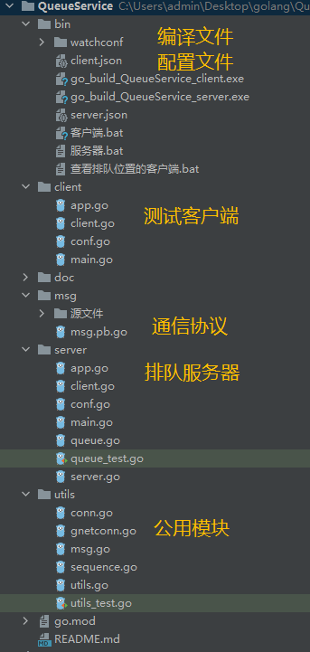

## 模块功能说明
* utils
  * utils.go 生成随机令牌、生成随机用户ID、统一的panic处理
  * sequence.go 协成池任务队列，保证任务顺序执行，解决消息的顺序和数据安全问题
  * msg.go 消息头、消息注册和解析消息接口
  * gnetconn.go 封装的gnet连接对象，服务器中客户端的连接对象，方便消息数据解析和发送，消息注册分发功能，使用sequence，保证每个conn对象处理消息是顺序
  * conn.go 封装的net.TCPConn连接对象，客户端使用，同上
* msg
  * 【源文件】目录中放置消息定义文件和消息导出命令
  
* server
  * app.go 表示程序对象，通过实例 theApp 来表示全局的程序对象，记录
  * conf.go 表示配置对象，通过实例 theConf 来访问
  * server.go 表示服务器对象，通过实例 theServer 来访问
    * 开启监听，处理客户端的连接和断开，记录连接对象
    * 记录在线人数和最近1秒登录的人数，控制用户是否要排队
  * client.go 表示连接的客户端
    * 内部注册消息，处理客户端发来的消息
    * 内部和conn使用同一个sequence，来保证数据的安全性，client内部所有的变量和函数都通过sequence来访问
    * 记录用户的登录状态
  * queue.go 排队模块，通过实例 theQueue 来访问
    * 变量clientPos(map)、clientList(list) 来表示用户排队列表，使用读写锁保护
    * changeChann 新增和删除用户写入此channel中，把数据保存到 changeList 中
    * 内部运行了一个gorutine来把 changeList 数据更新到排队列表中
    * 同时开启另一个gorutine，检查可以登录的用户
  
* client 测试客户端
  * app、client、conf，主要通能同server服务器，client对象是通过配置来创建个数
  * client登录成功后，会触发一定概率的下线重连(app.UpdateClient)，模拟用户掉线，给其他排队用户让位置
  
* 边界检查问题基本上在开发的过程中都考虑
  

## 部署方式
###### 目前只编译了Windows版本的执行程序，需要在Windows环境下测试
#### 进入到bin目录下，可以看到三个批处理命令，如下
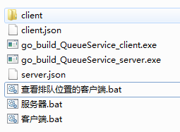
* 【服务器.bat】 启动服务器程序，会读取server.json中的配置，配置参数如下：
  * "pprof":1              // 开启性能监控
  * "maxonlinenum":50000   // 最大在线人数
  * "loginnumpresec":500   // 每秒允许最大的登录人数
  * "color":1              // 终端日志输出是否带颜色信息 windows自动终端好像不支持 可以使用Cmder终端

* 【客户端.bat】 启动服务器程序，会读取client.json中的配置，配置参数如下：
  * "clientnum":5000   // 最大在线人数
  * "showqueue":0      // 是否显示
  * "color":1          // 终端日志输出是否带颜色信息 windows自动终端好像不支持 可以使用Cmder终端
* 【查看排队位置的客户端.bat】 客户端程序读取watchconf下的配置，只启动一个客户端，并打印当前客户端排队信息

## 测试数据
```
测试服务器配置成最多支持5万用户在线，新增用户都需要进入登录排队列表
开启11个客户端，每个客户端配饰5000用户，每5秒启动一个客户端
最终会保持5000人在排队中
因为客户端会模拟掉线，查看自己的排队位置会不断的向前变化中

【目前只制作了一个测试中的截图数据，详细的数据变化流程没有，不过从下面的截图数据可以看出，服务器在面对5万个链接时没有表现出压力来】
```
* 服务器输出内容
  * conn 连接个数
  * lastconn 最近1秒的连接数
  * lastdisconn 最近1秒断开的连接数
  * lastlogin 最近1秒登录成功的用户数
  * online 当前在线人数
  * queueadd 最近1秒，加入队里的人数
  * queuelen 当前排队的人数
  * queuelogin 最近1秒通过队里登录成功的人数
  * queueremove 最近1秒，从队里里移除的人数和 lastdisconn 一致
*  
* 服务器启动后的状态，客户端还未启动
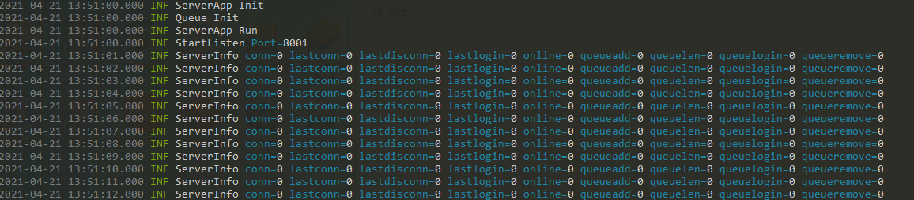
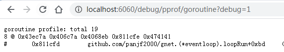
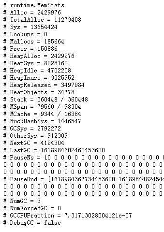
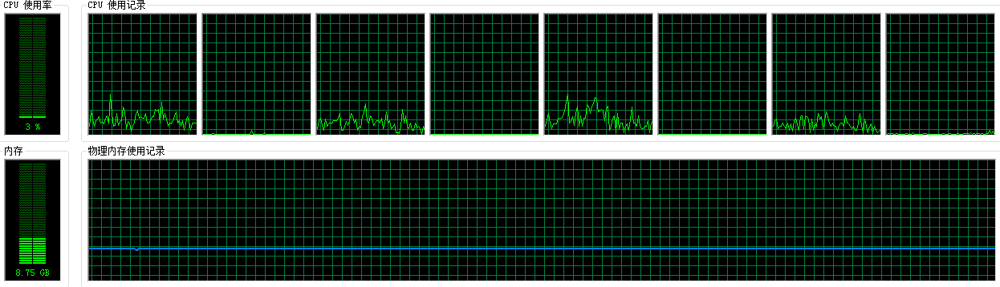
*  
* 测试客户端在启动时的状态
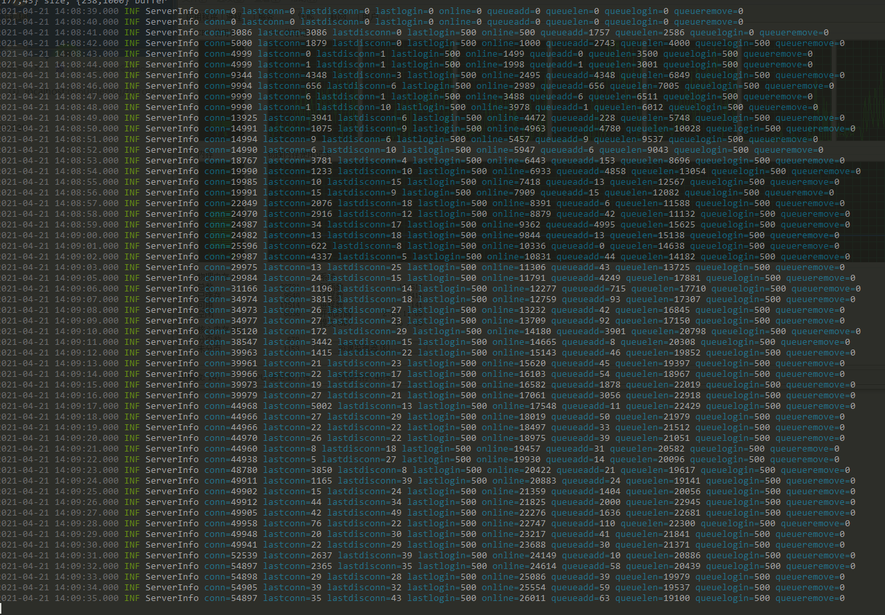
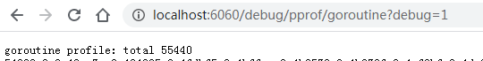
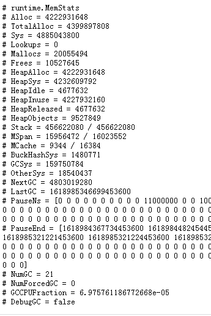
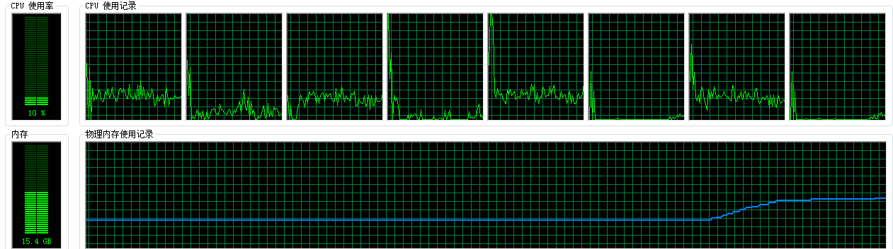
*
* 排队客户端查看排队位置
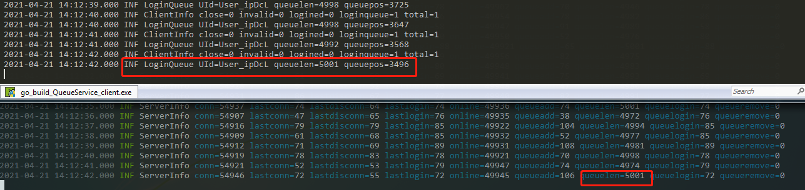